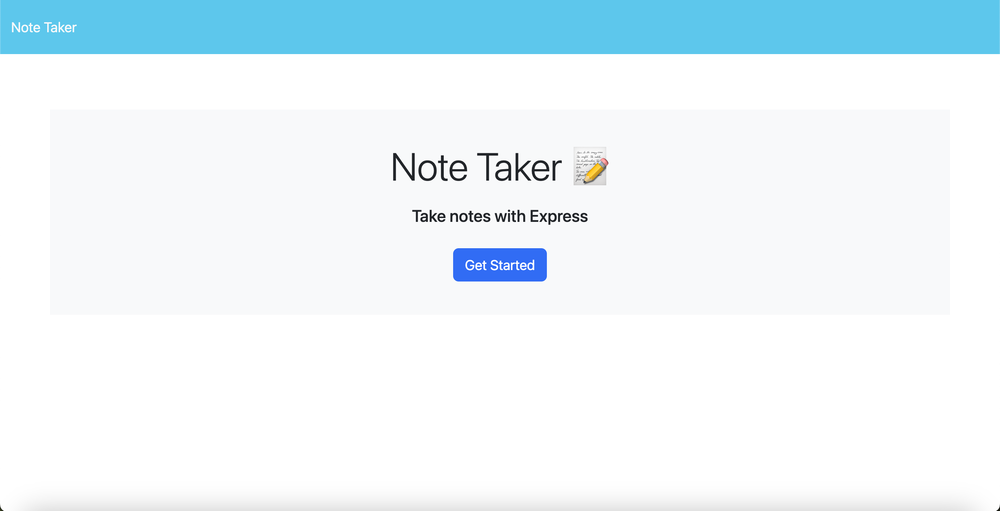
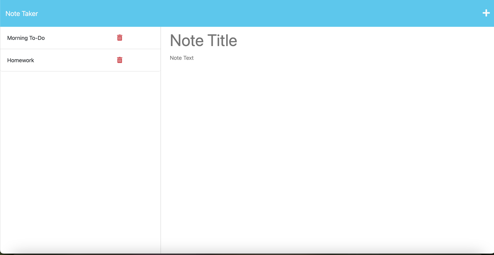

# Note Taker

## Description

This week's challenge is to create an application called Note Taker that can be used to write and save notes. This application will use an Express.js back end and will save and retrieve note data from a JSON file. 

[Link to deployed application on Heroku](https://stormy-ridge-77061.herokuapp.com/)

Below is a preview of the application when viewing the deployed link. 

## Credits

The application's front end was cloned from the Bootcamp's starer code. 